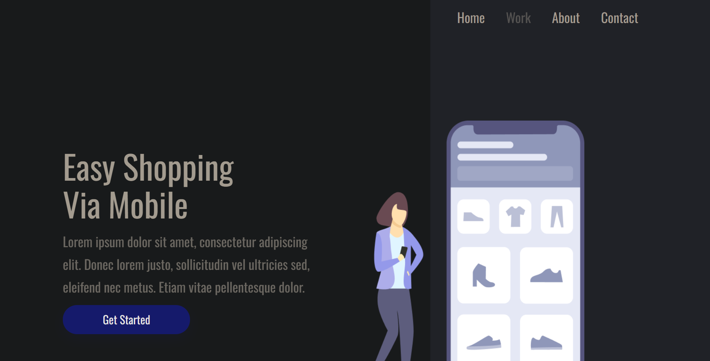

# Easy Shopping Via Mobile — Landing Page

> Página de apresentação para plataforma de compras mobile, com foco em layout responsivo, navegação fluida e UI moderna — desenvolvida durante os primeiros estudos em HTML5 e CSS3.


🔗 **[Ver projeto online](https://luuckysilva.github.io/easy-shopping-mobile-landing-page/)**

---

## 📋 Sobre o projeto

Um dos primeiros projetos desenvolvidos na entrada na área Front-End. O objetivo era construir uma landing page completa do zero — com navegação funcional, seções bem definidas e responsividade — usando apenas HTML e CSS, sem frameworks ou bibliotecas.

O projeto foi importante para solidificar conceitos de estrutura semântica, hierarquia visual e adaptação de layout para diferentes telas.

---

## ✦ Funcionalidades

- Layout responsivo para desktop e mobile
- Menu de navegação com links internos
- Hero section com CTA e ilustração
- Seções: Home, Features, About e Contact
- UI limpa e moderna com foco em produto mobile

---

## 🖼️ Preview



> Caso a imagem não carregue, [acesse o deploy](https://luuckysilva.github.io/easy-shopping-mobile-landing-page/) diretamente.

---

## 📁 Estrutura do projeto

```
easy-shopping-mobile-landing-page/
├── assets/        # Imagens e ilustrações
├── index.html     # Estrutura da página
└── styles.css     # Estilização completa
```

---

## 🎯 Objetivos de aprendizado

- Aplicar estrutura semântica HTML5 em um projeto completo
- Praticar responsividade com CSS puro e media queries
- Desenvolver senso de hierarquia visual e composição de layout
- Construir uma página funcional do zero sem frameworks

---

## 🚀 Melhorias futuras

- [ ] Adicionar menu mobile com toggle em JavaScript
- [ ] Implementar animações de scroll nas seções
- [ ] Conectar formulário de contato a um backend
- [ ] Refinar espaçamentos e tipografia com as evoluções adquiridas

---

## 👨‍💻 Autor

**Lucas Silva**

[](https://www.linkedin.com/in/lucas-silva-403412a4/)
[](https://github.com/LuuckySilva)
